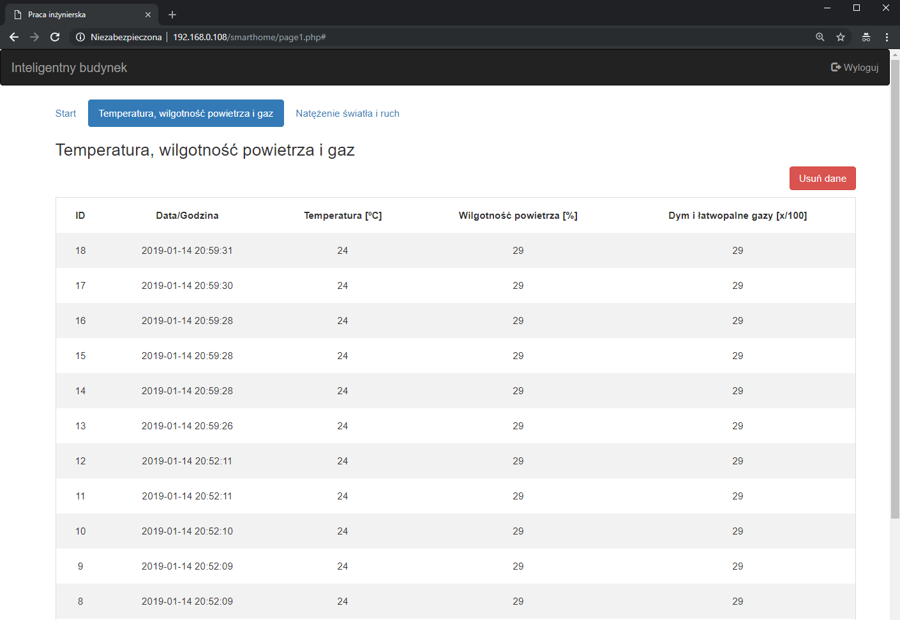

## `This is part of a smart home web app project`

This project concerns the development of a wireless smart home system using Raspberry Pi.

### `Diagram`

The system enables the user to get temperature, humidity,  light intensity and gas sensor data through a web application.
The user can access the data from the apache server running on a Raspberry Pi 3B+ functioning as 
the main node of the network. The Raspberry Pi receives measurements from arduino units equipped with sensors. 
Communication between Raspberry Pi and arduino is established using Xbee modules. The user can access historical data, is warned when smoke is detected, can controll the simulation mode which controls the light in the room according to the saved historical data of homowners habits.

### `User interface`

### `Description `

* main.c - the program uses multithreading. There are two types of threads created. The main thread continuously listening for incoming messages and whe received parses and saves them to the My SQL database. The other type is responsible for requesting every time a set time intercal passes. You can set a different time interval for when there is no motion in the room and for when movement in the room was detected. 
* login.php - login form, checks credentials. Uses sessions to remember user as well prevent unauthorized access to other pages.
* page1.php - user dashboard. Provides you with an overview over the latest data as well as enables you to turn on/off the "we are home" simulation which controls the light and switches it on/off according to the historical data of your habits. You can also turn the light on/off by clicking the designated buttons. 
* destroy.php - logs the user out- deletes the session

### `Raspberry Pi configuration `
For the purpose of this project an apache server was set up on the RPi.
To store the data an MySQL database was used.
The RPi has been configured to automatically connect to the local wifi network and set up to have a static ip address.
The final step was to correctly setup the riderects in the loal wifi routers configurations. A rule was put in place to redirect all requests to the routers 8080 port straight to the port 80 of th Raspberry Pi

### `Wiring `

An overview of the wiring for the arduino module is shown below. For more specific schematics please see the wiring directory in this repository or the manufacturers documentation. 

